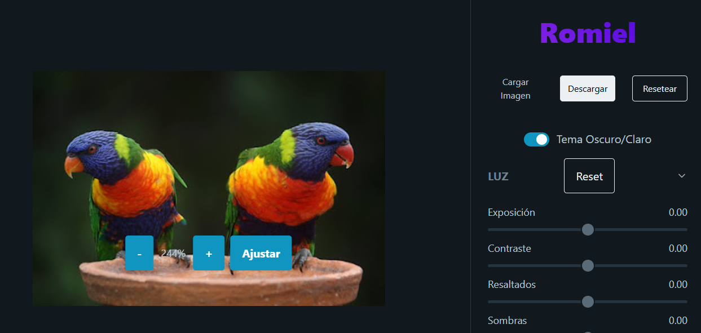

# Romiel Photo Editor

A lightweight, browser-based photo editor built with modern web technologies. It provides a clean interface for applying real-time, GPU-accelerated image filters and adjustments.

 <!-- It's a good practice to add a screenshot of your app -->

## ✨ Features

*   **Real-Time Editing**: All adjustments are rendered instantly on the canvas thanks to WebGL.
*   **Core Adjustments**:
    *   **Light**: Control Exposure, Contrast, Highlights, and Shadows.
    *   **Color**: Adjust Temperature and Saturation.
    *   **Effects**: Add Vignette and Film Grain (Noise).
    *   **Details**: Sharpen your image with an Unsharp Mask.
*   **Non-Destructive Workflow**: Reset individual sections or the entire image back to its original state at any time.
*   **High-Quality Export**: Download your edited image as a high-quality JPG, processed at its original resolution.
*   **Modern UI**:
    *   Clean, minimalist design using Pico.css.
    *   Responsive layout for both desktop and mobile devices.
    *   Switch between Dark and Light themes.
*   **Canvas Controls**: Zoom in/out, pan with the mouse wheel, and fit the image to the screen.

## 🚀 Technologies Used

*   **Frontend**: HTML5, CSS3, JavaScript (ES Modules)
*   **Image Processing**: [glfx.js](https://evanw.github.io/glfx.js/) - A powerful JavaScript library that uses WebGL for GPU-accelerated image effects.
*   **CSS Framework**: [Pico.css](https://picocss.com/) - For elegant, minimal styling with no extra fluff.
*   **Build Tool**: No complex build step required. The project is structured to run directly in modern browsers.

## 📂 File Structure

The project is organized into a few key files:

```
├── dist/
│   └── main.js         # Core application logic, state management, and event handling.
├── lib/
│   └── glfx.js         # The third-party image processing library.
├── index.html          # The main HTML file defining the application structure.
├── styles.css          # Custom styles to theme and layout the editor.
└── README.md           # You are here!
```

*   **`index.html`**: Defines the complete UI layout, including the canvas, sidebar, buttons, and control panels. It links all necessary CSS and JavaScript files.
*   **`styles.css`**: Contains custom CSS to supplement Pico.css, giving the editor its unique look and responsive behavior.
*   **`lib/glfx.js`**: The minified `glfx.js` library. This is the "engine" that powers all the photo editing features.
*   **`dist/main.js`**: The heart of the application. This script is responsible for:
    *   Handling image uploads.
    *   Initializing the `glfx.js` WebGL canvas.
    *   Dynamically generating the control sliders based on a configuration object.
    *   Managing the editor's state (current filter values).
    *   Applying the filter chain in real-time using `requestAnimationFrame`.
    *   Handling the download, reset, zoom, and theme-switching logic.

## 🛠️ How It Works

1.  **Image Load**: The user selects an image, which is loaded into the browser using the `FileReader` API.
2.  **Canvas Initialization**: An `Image` object is created. Once loaded, `glfx.js` initializes a WebGL-enabled `<canvas>` and creates a "texture" from the image. This texture is stored on the GPU.
3.  **Real-Time Adjustments**: When a user moves a slider, the corresponding value in the `editorState` object is updated. A `requestAnimationFrame` is scheduled.
4.  **Filter Chain**: In the next frame, the `applyFilterChain` function is called. It takes the original image texture and applies the entire sequence of filters (brightness, contrast, saturation, etc.) with the latest values from `editorState`. Because this happens on the GPU, it's incredibly fast.
5.  **Download**: To export the image, a new, temporary `glfx.js` canvas is created in memory with the **original image's dimensions**. The same filter chain is applied to this high-resolution canvas, which is then converted to a Data URL and triggered for download.

## 🏁 Getting Started

Since this is a client-side application, there's no complex setup.

1.  Clone the repository:
    ```bash
    git clone https://github.com/your-username/Romiel-Photo-Editor.git
    ```
2.  Open the `index.html` file in a modern web browser (like Chrome, Firefox, or Edge) that supports WebGL and ES Modules. For best results, serve the files from a local web server.